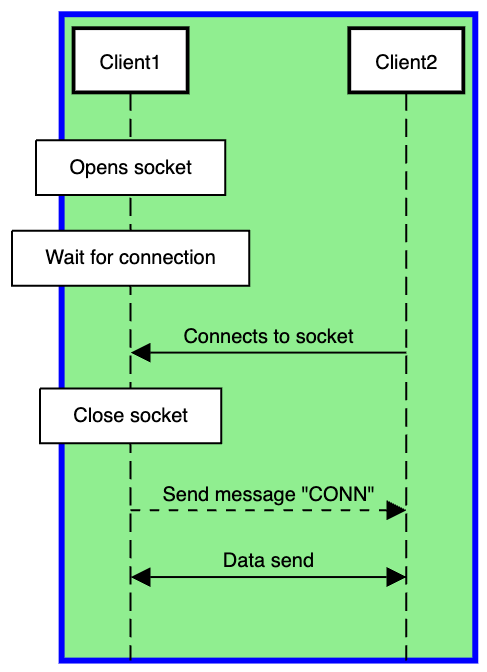
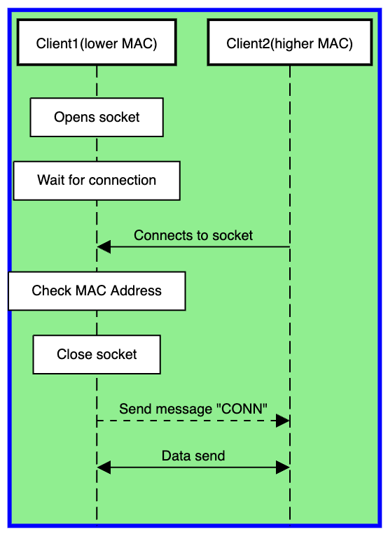
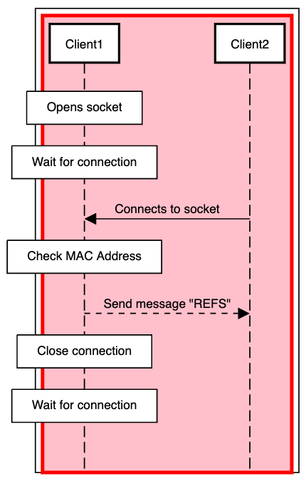

  

  <strong>A powerful and simple Android app for managing Bluetooth connections and data transfer between devices.</strong> 
  Built with native Android components and a focus on clean UI and reliable performance.

### 📱 Features

- 🔍 Scan for available Bluetooth devices
- 🔗 Pair and connect with devices
- 📤 Send and receive data over Bluetooth
- 🗂️ Manage bonded devices
- 📶 Real-time connection status
---

### 🧱 Architecture & Tech Stack

- **Architecture Pattern:** MVI (Model-View-Intent)
- **UI Toolkit:** [Jetpack Compose](https://developer.android.com/jetpack/compose)  
- **State Management:** `StateFlow`, `MutableState`, and `ViewModel`  
- **Bluetooth API:** Android classic Bluetooth stack for device discovery, pairing, and communication  
- **Local Storage:** [Room](https://developer.android.com/jetpack/androidx/releases/room)  
- **Dependency Injection:** Hilt  
- **Navigation:** Jetpack Compose Navigation  
- **Permissions:** Runtime permissions for Bluetooth and Location  
- **Language:** Kotlin  
- **Build Tools:** Gradle (Kotlin DSL)  

### 💡 Future Improvements
- 🔐 Secure communication
- 🧩 Kotlin Multiplatform (KMP) for cross-platform code sharing

## Connection establishing diagrams

#### First time connecting

#### Trying to connect with client which was already connected

<table>
  <tr>
    <td align="center">
      <b>Success</b> 
      
    </td>
    <td align="center">
      <b>Failure (unexpected MAC address)</b> 
      
    </td>
  </tr>
</table>